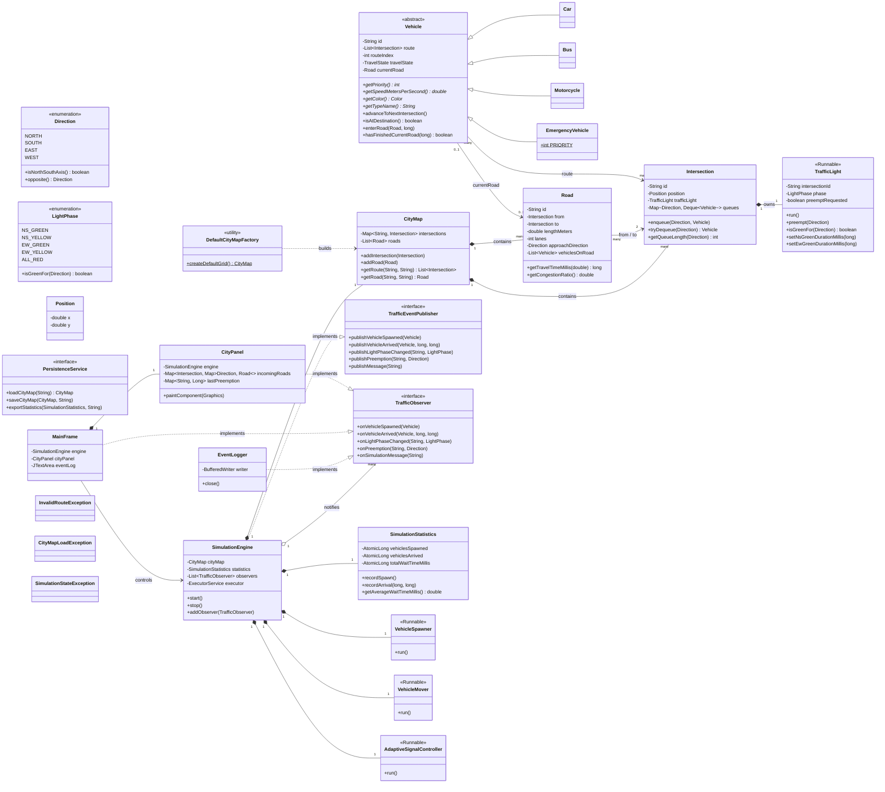

# Class Diagram

Renders directly in GitHub's markdown preview. For the submission zip
(which needs a PDF/image, not markdown), export this with the VS Code
"Markdown Preview Mermaid Support" extension (right-click the diagram ->
"Export as PNG/SVG"), or paste the mermaid source below into
[mermaid.live](https://mermaid.live) and export from there. `class-diagram.puml`
next to this file is the same diagram in PlantUML syntax, if your tool of
choice prefers that instead.

**Keep this updated as the design changes** — the project report needs
to describe how the UML evolved during coding, so if you deviate from
what's drawn here, note why in `docs/ProjectReport.md` rather than
silently diverging.

